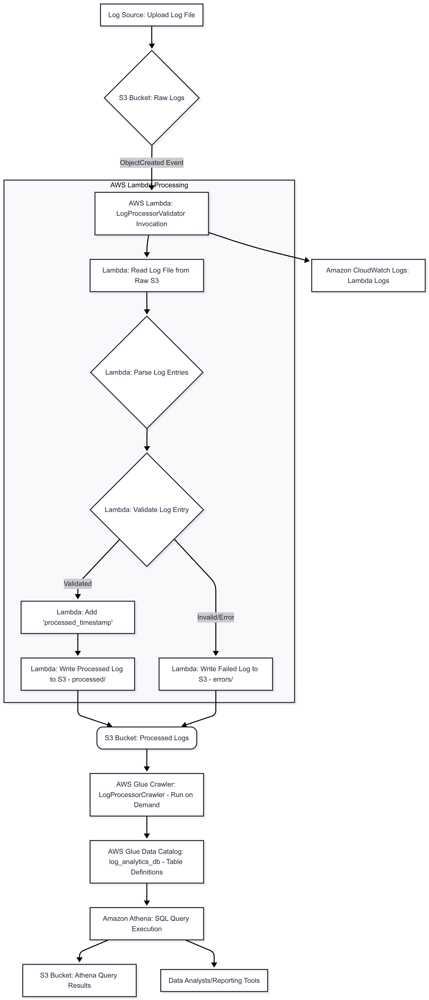

````markdown
# AWS S3 & Lambda Event-Driven Log Processor

This project demonstrates an event-driven data workflow on Amazon Web Services (AWS) using S3 and Lambda to process and validate incoming log files, making them queryable via AWS Athena. It's designed with AWS Free Tier considerations in mind, making it suitable for learning and personal projects.

## Architecture Diagram

A visual representation of the data flow:



## Project Overview

This project showcases a fundamental cloud-native data engineering pattern:

  * **Event-Driven Ingestion:** New log files arriving in an S3 bucket trigger a serverless function.
  * **Serverless Processing:** AWS Lambda performs validation and transformation without requiring server management.
  * **Data Lake Storage:** Processed and raw data reside in S3, providing scalable and cost-effective storage.
  * **Metadata Management:** AWS Glue Data Catalog stores schemas, enabling easy querying.
  * **Interactive Querying:** Amazon Athena allows direct SQL queries on S3 data, ideal for analytics and reporting.

## AWS Services Used

  * **Amazon S3:** For raw log ingestion and storing processed/error logs, and Athena query results.
  * **AWS Lambda:** Serverless compute for processing and validation logic.
  * **AWS Glue Data Catalog:** Metadata repository, populated by a Glue Crawler.
  * **AWS Glue Crawler:** Automatically infers schema from S3 data.
  * **Amazon Athena:** Interactive query service for running SQL queries on S3 data.
  * **Amazon CloudWatch Logs:** For monitoring and debugging Lambda function execution.

## Setup Instructions (Step-by-Step Guide)

**Prerequisites:**

  * An AWS Account (Free Tier eligible).
  * AWS CLI configured (optional, but helpful for programmatic interaction).
  * Basic understanding of AWS S3, Lambda, Glue, and Athena.

### 1\. AWS Account Setup

  * Create an AWS account if you don't have one. **Monitor your billing dashboard regularly** to stay within Free Tier limits.
  * Choose a preferred AWS Region (e.g., `us-east-1`, `ap-south-1`). All resources should ideally be in the same region.
  * **(Optional but Recommended)** Create an IAM user with appropriate permissions (`AmazonS3FullAccess`, `AWSLambda_FullAccess`, `AWSGlueConsoleFullAccess`, `AmazonAthenaFullAccess`) and use its credentials for better security practices.

### 2\. Create S3 Buckets

  * Go to the S3 service in the AWS Console.
  * Create two S3 buckets in your chosen region:
      * **Raw Logs Bucket:** `my-log-ingestion-raw-bucket-<yourname>-<suffix>` (replace `<yourname>-<suffix>` with unique identifiers).
      * **Processed Logs Bucket:** `my-log-ingestion-processed-bucket-<yourname>-<suffix>` (for processed, validated, and error logs, and Athena results).
  * Ensure default settings (ACLs disabled, block public access enabled) for both.

### 3\. Develop the Lambda Function (`LogProcessorValidator`)

  * Go to the Lambda service in the AWS Console.
  * Click "Create function".
      * **Function name:** `LogProcessorValidator`
      * **Runtime:** `Python 3.9` (or newer, check free tier compatibility if unsure)
      * **Architecture:** `arm64` (AWS Graviton2 processors are generally cheaper and part of the free tier)
      * **Execution role:** Choose "Create a new role with basic Lambda permissions".
  * Click "Create function".

#### Configure Lambda Permissions (IAM Role)

After the function is created:

  * Go to the "Configuration" tab, then "Permissions".
  * Click on the **Role name** (it will be something like `LogProcessorValidator-role-xxxx`). This opens the IAM console.
  * **Add Permissions:** You need to allow your Lambda function to read from the raw S3 bucket, write to the processed S3 bucket, and write logs to CloudWatch.
      * Ensure the role has the `AWSLambdaBasicExecutionRole` managed policy attached, which grants CloudWatch logging permissions (`logs:CreateLogGroup`, `logs:CreateLogStream`, `logs:PutLogEvents`).
      * Add an **inline policy** or attach a custom policy to grant S3 access. Go to "Add permissions" -\> "Create inline policy" -\> JSON tab, and paste the following, replacing bucket names:
        ```json
        {
            "Version": "2012-10-17",
            "Statement": [
                {
                    "Effect": "Allow",
                    "Action": [
                        "s3:GetObject"
                    ],
                    "Resource": "arn:aws:s3:::your-raw-bucket-name/*"
                },
                {
                    "Effect": "Allow",
                    "Action": [
                        "s3:PutObject"
                    ],
                    "Resource": "arn:aws:s3:::your-processed-bucket-name/*"
                }
            ]
        }
        ```
      * Click "Review policy", give it a name (e.g., `S3AccessForLogProcessor`), and "Create policy".

#### Upload Lambda Function Code

  * Back in the Lambda function console, go to the "Code" tab.
  * Replace the default code with the Python code from `lambda_function.py` in this repository.
  * Click "Deploy".

#### Configure Environment Variables

  * Go to the "Configuration" tab, then "Environment variables".
  * Add a new environment variable:
      * **Key:** `PROCESSED_BUCKET`
      * **Value:** The exact name of your `my-log-ingestion-processed-bucket-...`.
  * Click "Save".

#### Adjust Lambda Timeout and Memory

  * Go to "Configuration" -\> "General configuration" -\> "Edit".
  * **Memory:** Start with `128 MB` (sufficient for small files and within free tier limits).
  * **Timeout:** Set it to `1 min` or `5 min` (depending on expected log file size and processing time).
  * Click "Save".

### 4\. Configure S3 Event Trigger for Lambda

This connects your raw S3 bucket to your Lambda function, so uploads automatically trigger processing.

  * Go to your `my-log-ingestion-raw-bucket-...` in the S3 console.
  * Go to "Properties" tab, then scroll down to "Event notifications" and click "Create event notification".
      * **Event name:** `TriggerLambdaOnLogUpload`
      * **Suffix:** `.log` (This ensures only files ending with `.log` trigger the function).
      * **Event types:** Select "All object create events" (e.g., `Put`, `Post`, `Copy`).
      * **Destination:** Choose "Lambda function".
      * **Lambda function:** Select your `LogProcessorValidator` function.
  * Click "Create event notification".

### 5\. Test the Workflow

  * **Create a sample log file:**
      * Save the content below as `sample_log.log` on your local machine (also available in this repository).
        ```json
        {"timestamp": "2025-07-21T10:00:00Z", "level": "INFO", "message": "User login successful", "user_id": "abc123"}
        {"timestamp": "2025-07-21T10:00:05Z", "level": "ERROR", "message": "Failed to connect to database", "error_code": 500}
        {"timestamp": "2025-07-21T10:00:10Z", "raw_message": "Invalid format log"}
        {"timestamp": "2025-07-21T10:00:15Z", "level": "DEBUG", "message": "Application health check"}
        ```
  * **Upload the log file:** Go to your `my-log-ingestion-raw-bucket-...` S3 bucket, click "Upload", and select `sample_log.log`.
  * **Monitor Lambda Execution:**
      * Go to the Lambda console for `LogProcessorValidator`.
      * Click on the "Monitor" tab. You should see invocations and successful executions soon.
      * Click on "View logs in CloudWatch" to see the detailed output of your Lambda function, including print statements and any errors.
  * **Verify Processed and Failed Logs:**
      * Check your `my-log-ingestion-processed-bucket-...` S3 bucket. You should see new objects:
          * One under a `processed/` prefix containing the validated log entries.
          * One under an `errors/` prefix containing the failed log entries.

### 6\. Create AWS Glue Data Catalog Tables

AWS Glue Data Catalog acts as a metadata repository for your data in S3, allowing Athena to query it.

  * Go to the AWS Glue service in the AWS Console.
  * **Create a Database:**
      * In the left navigation, click "Databases" -\> "Add database".
      * **Database name:** `log_analytics_db`
  * **Create a Crawler:** A crawler automatically infers schema from your S3 data.
      * In the left navigation, click "Crawlers" -\> "Create crawler".
      * **Crawler name:** `LogProcessorCrawler`
      * **Source type:** "Data stores" -\> "S3"
      * **Include path:** Browse to your `my-log-ingestion-processed-bucket-...` and select the `processed/` folder (e.g., `s3://my-log-ingestion-processed-bucket-.../processed/`).
      * **Add another data store:** Add another location pointing to `s3://my-log-ingestion-processed-bucket-.../errors/`.
      * **IAM Role:** Choose "Create new IAM role" and give it a name (e.g., `AWSGlueServiceRoleForLogs`). Glue will attach necessary S3 and Glue permissions.
      * **Frequency:** "Run on demand" (to avoid continuous free tier consumption).
      * **Output:** Choose the `log_analytics_db` database you created.
  * Click "Create crawler".
  * **Run the Crawler:** Select the `LogProcessorCrawler` and click "Run crawler". Wait for it to complete. It will create tables (e.g., `processed_logs`, `errors_logs`) in your `log_analytics_db`.

### 7\. Query Data with Amazon Athena

Athena allows you to run SQL queries directly on data in S3, using the Glue Data Catalog.

  * Go to the Amazon Athena service in the AWS Console.
  * **Set up Query Result Location:** If it's your first time, Athena will prompt you to set an S3 bucket for query results. Use your `my-log-ingestion-processed-bucket-...` and create a subfolder like `athena-query-results/`.
  * **Select Database:** In the query editor, select `log_analytics_db` from the database dropdown.
  * **Run Sample Queries:**
    ```sql
    SELECT * FROM "log_analytics_db"."processed_logs" LIMIT 10;
    SELECT level, COUNT(*) AS log_count FROM "log_analytics_db"."processed_logs" GROUP BY level;
    SELECT * FROM "log_analytics_db"."errors_logs" LIMIT 10;
    ```

## Project Cleanup (Crucial for Free Tier)

To avoid unexpected charges, **always delete all resources after you're done experimenting.**

1.  **Delete Athena Tables/Databases:** In Athena, delete your tables (`processed_logs`, `errors_logs`) and then the `log_analytics_db` database.
2.  **Delete AWS Glue Crawler:** In Glue -\> "Crawlers", delete `LogProcessorCrawler`.
3.  **Delete AWS Lambda Function:** In Lambda -\> "Functions", delete `LogProcessorValidator`.
4.  **Delete S3 Buckets:** In S3, **empty both** `my-log-ingestion-raw-bucket-...` and `my-log-ingestion-processed-bucket-...` *before* deleting them.
5.  **Delete IAM Roles/Policies (Optional but Recommended):** In IAM, delete any custom IAM roles (e.g., `LogProcessorValidator-role-xxxx`, `AWSGlueServiceRoleForLogs`) and policies you created.

## Future Enhancements

  * **Advanced Validation:** Implement more complex data quality checks (e.g., regex matching, range checks, custom business rules).
  * **Error Handling:** Implement dead-letter queues (DLQs) for failed Lambda invocations or utilize AWS Step Functions for robust error recovery workflows.
  * **Data Formats:** Write processed data to optimized columnar formats like Parquet or ORC for better Athena query performance and cost efficiency.
  * **Orchestration:** Introduce AWS Step Functions for more complex stateful workflows, or consider AWS MWAA (Managed Workflows for Apache Airflow) for scheduled, complex pipelines if scaling beyond serverless is needed (e.g., integrating with Spark/EMR).
  * **Infrastructure as Code (IaC):** Use AWS CloudFormation or Terraform to define and deploy all resources programmatically, ensuring consistency and repeatability.
  * **Alerting & Monitoring:** Set up CloudWatch alarms for Lambda errors, S3 bucket size thresholds, or Athena query costs.
  * **Reporting & Visualization:** Connect Athena to BI tools like Amazon QuickSight or Tableau for dashboarding and advanced analytics.

-----

```
```
